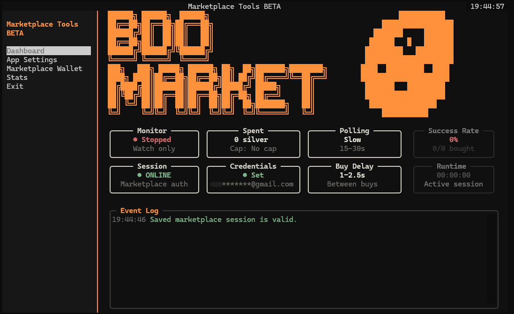

<div align="center">

# Marketplace Tools

<p>
  <a href="https://www.python.org/downloads/">
    
  </a>
  
  
  
</p>

<p>
  
  
  
  
</p>

</div>




Python CLI app for monitoring the *Black Desert Online* marketplace through authenticated HTTP/API requests. It maintains a persistent marketplace session, continuously checks for outfit listings at a custom polling interval, handles long-running monitoring sessions with custom built re-authentication workflow, and executes buy-order requests as soon as matching items become available, in millieseconds.


## Features

### Core Capabilities

- Live interactive dashboard.
- Monitors BDO marketplace for outfit listings.
- Automated purchasing of outfits upon detection.
- Adjustable marketplace polling speed and delay between individual buy attempts.
- Custom silver spend cap per session, stopping future purchases if cap is met.
- Tracks current session's outfit detections, successful purchases, and silver spent. 
- Tracks lifetime silver spent, and successful purchases.
- Provides logging for actions, purchases, detection, and errors.
- Provides a marketplace wallet view for checking stored silver, Value Pack state, and marketplace inventory data (WIP).

### Technical Features

- Marketplace API integration for listing scans, wallet data, session refresh, authentication, and `BuyItem` purchase requests.
- Concurrent marketplace polling with isolated unauthenticated `requests.Session` clients for male and female outfit categories, preserving connection reuse without sharing authenticated state.
- Custom Huffman response decoder for packed marketplace payloads, optimized for repeated high-frequency scans.
- Async monitor orchestration around blocking HTTP calls using `asyncio.to_thread()`, randomized polling windows, capped retry backoff, task lifecycle guards, and crash-aware monitor state.
- Secure session and credential persistence with JSON cookie storage, legacy pickle-session migration, local email initialization, and OS keyring-backed password storage.
- Safety-gated purchase pipeline with explicit buy-mode confirmation, spend-cap enforcement, configurable per-item buy delay, session-expiration recovery, and one-time retry on expired marketplace sessions.
- Structured purchase result parsing that separates fulfilled purchases from pre-order placements, records actual execution prices, and maps known marketplace result codes into actionable event-log messages.
- Resilient network and response validation for timeouts, malformed JSON, unexpected API shapes, invalid listing rows, stale pricing, duplicate orders, and unavailable items.
- Textual-based terminal dashboard with live runtime metrics, modal control flows, wallet/status views, test-mode-only simulation controls, and headless UI workflow tests.
- Focused unit coverage for listing parsing, pricing conversion, spend caps, session refresh behavior, purchase accounting, runtime file initialization, and dashboard workflows.

## Project Status

This project is currently undergoing a codebase rewrite and Textual UI migration. Features may be incomplete, unstable, or temporarily broken while the modernization work is in progress.

## Supported Versions

Last verified compatibility: July 14, 2025.

Pearl Abyss launcher accounts are supported through saved email/password credentials.
Steam accounts are supported through a visible browser session: choose `Steam Account` in the Credentials dashboard modal, run Steam Initial Setup once, then use `Refresh Session` from the dashboard. Initial setup uses the app-owned browser profile to visit the main Black Desert site, handle required-only cookie consent when available, and open Steam's official login page so you can manually log into Steam. The app only observes local browser state, such as Steam login cookie names or the loaded Store account menu, then closes the browser when Steam login is detected. Steam credentials and OTP values are never stored by the app.

## Running the App

Install dependencies from the repository root:

```powershell
py -3 -m pip install -r requirements.txt
```

On Windows, start the app with:

```powershell
run.bat
```

Or run directly from the repository root:

```powershell
py -3 main.py
```

`run.bat` uses Windows Terminal when available so the Textual UI opens at a usable size. Set `BDO_DISABLE_WT=1` before launching to run in the current console instead.

## Disclaimer

This repository is provided as a proof of concept for authenticated web sessions, HTTP requests, and marketplace-style API integration. Use it only in environments where automation is permitted by the relevant terms of service. The project does not handle CAPTCHA challenges or other access-control interruptions.

## Known Issues

If your IP reputation is low, the official login flow may present a CAPTCHA. This project does not handle CAPTCHA challenges. To confirm whether that is the issue, try logging in manually on the [BDO website](https://www.naeu.playblackdesert.com/en-US/Main/Index).

Known problematic result codes:

- `resultCode=30`: identical order already exists. This has been observed with `resultMsg=eErrNoAlreadyReservationDay`.
- `resultCode=34`: item unavailable, already taken, or the request would create a duplicate pre-order.
- `resultCode=-14`: price mismatch. This can happen when PA decide to change max outfit prices. needs updating if that's the case.
- `resultCode=2000`: marketplace login session expired upon buy attempt. The app attempts to refresh/re-authenticate and re buy the item.

Unknown purchase codes are reported as `resultCode {code}` in the event log so they can be documented after a new capture.

## Contact

For questions or bug reports, use the project issue tracker or the listed Discord contact: `._.__.__._._.__._____.__._.___.`

## Planned Work

- Manual QA for fresh and existing Steam browser profiles.
- More configurable marketplace categories.
